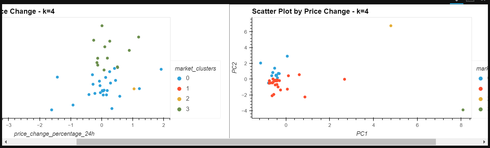

## Challenge 10 | SUMMARY

In this week’s challenge, I have created a machine learning model that groups cryptocurrencies to assemble investment portfolios that are based on the profitability of those cryptocurrencies. You'll be able evaluate and the contrast the best value of KMeans, explained variance ratios, elbow curves and clusters.

---

## Technologies

This project leverages python 3.7, scikit-lesarn and hvPlot.

Go to your terminal or git bash and run conda activate dev to activate your conda dev environment. 
You will then install the following librarie(s) and module(s) to run in Python codes created.
    pip install -U scikit-learn
    conda install -c pyviz hvplot
    
To ensure installation was complete, run the following...
    conda list scikit-learn
    conda list hvplot

---

## Usage

Go to the Anaconda Prompt to launch JupyterLab by typing Jupyter Lab. To use this application simply clone the repository and run the crypto_investments.ipynb in you Jupyter Lab Notebook.

---

## Visualization

---

## Contributors

linkedin.com/in/john-sung-3675569

---

## License

MIT